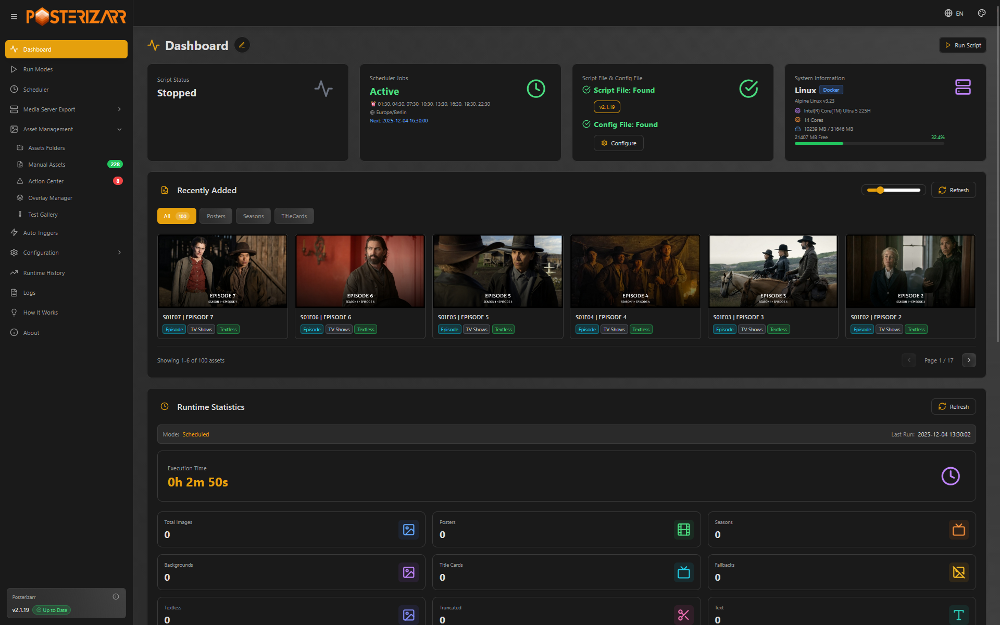

  

  <h1 align="center">Welcome to Posterizarr</h1>

  

    Automate the creation of beautiful, textless posters for your Plex, Jellyfin, or Emby library.
  

  

  
  

Posterizarr is a PowerShell script with a full Web UI that automates generating images for your media library. It fetches artwork from Fanart.tv, TMDB, TVDB, Plex, and IMDb, focusing on textless images and applying your own custom overlays and text.

* **User-Friendly Web UI:** Manage settings, monitor activity, and trigger runs from a browser.
* **Multiple Media Servers:** Supports Plex, Jellyfin, and Emby.
* **Kometa Integration:** Organizes assets in a Kometa-compatible folder structure.
* **Smart Integration:** Trigger runs from Tautulli, Sonarr, and Radarr.

  

